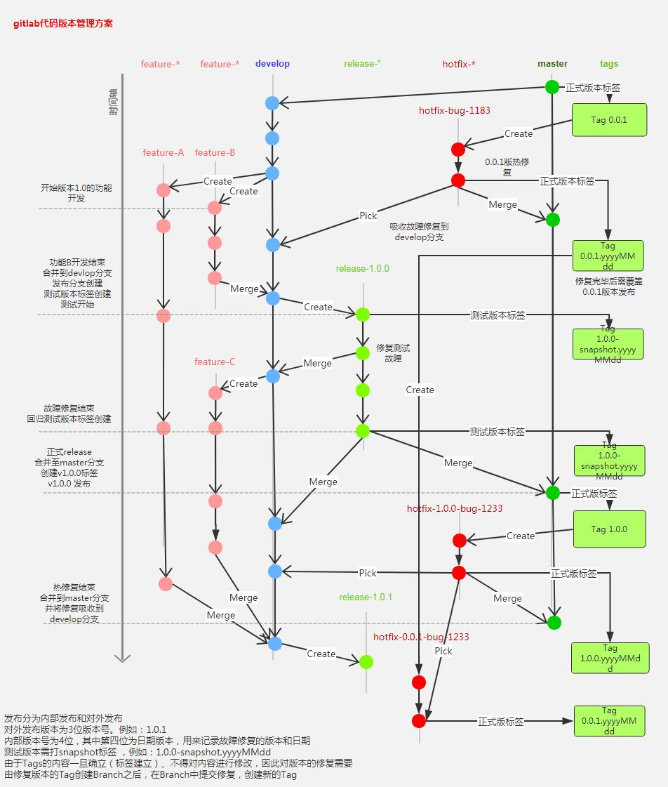

<b style="font-size: 2em">Git</b>

---

# 版本管理流程

<a href="../assets/git_flow.jpg" title="点击预览" target="_blank"></a>

---

# 常用命令

```text
// 在当前目录初始化为Git代码库
> git init

// 在当前目录下新建一个目录，并将其初始化为Git代码库
> git init {目录名称}

// 下载一个项目和它的整个代码历史
> git clone {url}

---

// 显示当前的Git配置
> git config --list

// 编辑当前的Git配置
> git config -e [--global]

// 设置提交代码是的用户信息
> git config [--global] user.name "{name}"
> git config [--global] user.email "{email}"

---

// 查看状态
> git status

// 查看变更内容
> git diff

// 添加指定文件到暂存区
> git add {file1} {file2} ...

// 添加指定目录（递归）到暂存区
> git add {dir}

// 添加当前目录的所有文件到暂存区
> git add .

```

**名词**

* master：默认开发分支
* origin：默认远程版本库
* Index / Stage：暂存区
* Workspace：工作区
* Repository：仓库区（或本地仓库）
* Remote：远程仓库
